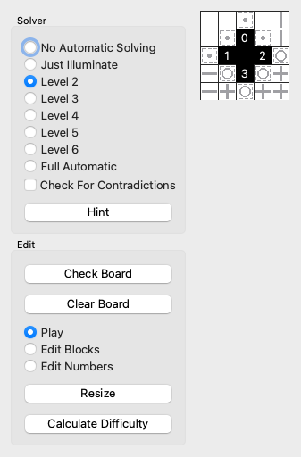
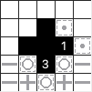
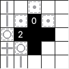
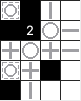
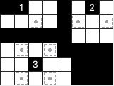
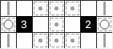

Puzzle Bicycle
==============
Puzzle Bicycle is an application that helps people have fun making and solving logic
puzzles like [Akari](https://www.nikoli.co.jp/en/puzzles/akari), Heyawake, and Suraromu,
by using special solvers that use human strategies. You can download it
[here](https://github.com/AlexSzatmary/puzzle-bicycle/releases).

For creators, Puzzle Bicycle lets you,
* set and solve your puzzle simultaneously
* know when your puzzle becomes impossible due to an error
* confirm that your puzzle has the difficulty level you intend

For players, Puzzle Bicycle lets you,
* automate moves that you find easy
* reset your puzzle to before your first mistake
* ask for hints that teach you how to solve like experts

Puzzle Bicycle will not generate random puzzles.

Akari is supported. I plan to do Heyawake and Suraromu next.

Inspiration
===========
* [Good Sudoku](https://www.playgoodsudoku.com/) uses a catalog of techniques that allow
  puzzles to be graded and contextual hints to be offered.
* [This article](https://web.archive.org/web/20200117074130/https://www.nikoli.co.jp/en/misc/20060703the_japan_time.html) on Nikoli.
* Steve Jobs said that a computer is like
  ["a bicycle for our minds"](https://www.youtube.com/watch?v=ob_GX50Za6c). Puzzle Bicycle is intended to help you think, not think for you.
* [pzprRT](https://semiexp.net/pzprrt/index.html) by
  [semiexp](https://semiexp.net/index.html) integrates solving and setting for logic 
  puzzles; the solver is an SMT solver that will show how much of the puzzle is solvable but does not use human strategies.

How you can help
================
I am taking input at this
[issues](https://github.com/AlexSzatmary/puzzle-bicycle/issues) page. I have created
issues for major features that I plan to add; please let me know what you see as a
priority. You can request features there. Of course, please report bugs.

Player guide
============
This section focuses on how to play puzzles in Puzzle Bicycle. Many of the features are
powerful and primarily intended for setters, not players.


Puzzle Bicycle opens with a simple puzzle and many controls.

Some puzzles are included with this application. More puzzles can be found online at
several sites. Here is one way to get puzzles.
* Go to the [PuzzleSquareJP Akari database](https://puzsq.logicpuzzle.app/?kind=18)
* Pick a puzzle.
* Click File>Save file as.
* In Puzzle Bicycle, click File>Open to load that puzzle.

Puzzle Bicycle has a solver that operates at adjustable levels. **No Automatic Solving**
disables the solver. With **Just Illuminate,** placing a bulb then blocks all free cells
that that bulb sees. Higher levels use increasingly sophisticated methods and all
methods from lower levels. **Just Illuminate** is a good first choice and **Level 2** makes
very simple moves automatically so either of those is a good choice for regular solving.
Higher levels give a lot away but can help when you are stuck.


In this example of **Just Illuminate**, the player has placed two bulbs. Cells are then illuminated: the gray lines show where new bulbs cannot be placed.



**Level 2** places bulbs around number cells that need them (the 3), and dots around numbers that have enough bulbs.


**Level 3** places bulbs that are the only way to illuminate a certain dot cell. For this simple puzzle, that level completes the solution. There are also higher levels.

**Check for Contradictions** immediately tells you if you have picked a wrong answer and
shows why. This can spoil puzzles.

**Hint** shows you the simplest next step to solve the puzzle.

If you think you made a mistake, click **Check Board**. **Check Board** tells you if
your board has a contradiction and offers to roll back to your last valid solution, or
to erase all mistakes. **Clear Board** lets you remove all marks.

Puzzle Bicycle loads with all controls shown. All controls are also accessible with the
menu bar. Controls can be shown or hidden with **View>Show Controls in Window**.


Setter guide
============
This section is for people who know how to solve puzzles and want to create ("set")
their own puzzles.

To set puzzles with Puzzle Bicycle, I use this workflow:

1. Make an interesting grid by placing "blocks" (black cells that are not yet numbered).
2. Add number clues to black cells. I alternate between adding clues to black cells and 
   placing bulbs and dots in white cells, until I need a new clue.
3. Using the solver, check to see that the puzzle has a unique solution that uses many
   different strategies, including even strategies that Puzzle Bicycle does not handle
   directly. Varying the solver level shows which strategies are involved.
4. Test solve myself, with the solver at just level 1 or 2.

I normally use these options: varying levels for step 2, Full Automatic in step 3, and
Check For Contradictions to immediately identify unworkable clues. Clear Board is useful
for solving the board from scratch.

Setting a puzzle is always an iterative process. For example, I sometimes find that I
need to rearrange the grid and even resize the puzzle to bring out interesting
strategies. Puzzle Bicycle removes tedium from these iterations.

You can create a new puzzle by clicking **File>New**,


which lets you directly set the number of rows and columns.

**Play** is the default mode for solving puzzles. **Edit Blocks** toggles cells between
being white or black. **Edit Numbers** lets you adjust the number clues in black cells,
and place bulbs or dots in white cells as in **Play**.

**Resize** makes this menu,


which adds or subtracts one row or column at
a time from a given side of the board. For example, to add a row at the bottom, click
the bottom +.

Calculate Difficulty tells the solver to complete the puzzle, always taking the easiest
next move. Each method takes some points; `guess_and_check` takes the total number of
points needed to make a deduction. Calculate Difficulty reports a cost (the total number
of points needed to solve) and a difficulty (the points needed for the hardest move); it
does this for the current board state and for a blank board. Large puzzles have a high
cost and puzzles that take a lot of guess and check or that take a clever trick have a
high difficulty score. For puzzles that use clever tricks that you expect players to
know, try entering what you would know from those tricks before calculating difficulty.

**File>Calculate Difficulty for Multiple Files** solves multiple puzzles in the
background and saves a CSV file showing for each its cost, difficulty, and time needed
for the solver. It asks you to open multiple files, and then asks for the filename for
the output CSV. It can take a few minutes to run if you have many tricky puzzles and
does not yet offer a progress indicator.

Akari methods
=============
Puzzle Bicycle solves problems by applying methods that human solvers use. Some methods
are direct applications of the rules of the puzzle but many are based on deductions you
can make in certain circumstances.

This section describes the methods that are in the Akari solver. Setters should learn
these methods to select the solver level in Puzzle Bicycle. Players do not need to know
the methods to solve Akari puzzles but may find them interesting.

Some of these strategies were articulated well by
[tomamic](https://www.ce.unipr.it/people/tomamic/files/akari-techniques.html).

Throughout, a bulb is a cell that shines light and a dot is any white cell that is known
to not be a bulb. Horizontal and vertical lines act like dots.

Level 1
-------
`illuminate` just shines light from the bulbs horizontally and vertically. Light from
illuminate acts as a dot marking a cell as not possibly holding a bulb. Here, a few
example bulbs are placed.


Level 2
-------
`mark_dots_around_full_numbers` detects which number cells are "full," or adjacent to as
many bulbs as their number. Therefore, dot all free cells adjacent to that number cell.
Here, the 3 cell calls for bulbs to be placed; the bulb next to the 1 forces the free
cells around the 1 to be dots.



***

`mark_bulbs_around_dotted_numbers` is the opposite of `mark_dots_around_full_numbers`.
If a number still needs as many bulbs as it has adjacent free cells, those cells must be
filled with bulbs. Here, the 0 places a dot next to the 2, which must then get bulbs in
its remaining free cells.



Level 3
-------
`mark_unique_bulbs_for_dot_cells` marks cells that must be bulbs for a dotted cell to be
illuminated.


***

`fill_holes` places bulbs in "holes;" a hole is a free cell that must itself be a bulb
because no bulb elsewhere could possibly reach it.



Level 4
-------
`mark_dots_at_corners` Marks dots at free cells diagonal to numbers if a bulb in that
cell would make it impossible for the number to get enough bulbs.



Level 5
-------
`analyze_diagonally_adjacent_numbers` Adds dots and bulbs for certain diagonally
        adjacent numbers sharing 2 free spaces.


When one number or the other "knows" that one of the 2 free spaces must have a bulb and
the other must not, we can fill bulbs or dots around the other number. More generally,
if one number needs the two free cells to have at least 1 bulb, and the other needs the
two free cells to have at least 1 dot, we can add a dot or bulb to each non-shared space
adjacent to those numbers.

Level 6
-------
`mark_bulbs_and_dots_at_shared_lanes`

The general idea is that two number cells have shared lanes if they have free cells
that compete for multiple lanes. In this example,
```
--------
-.1X.X.-
-.Y.Y1.-
--------
```
X and Y are the free cells that see each other. A lane is a line of sight. There are
relevant lanes connecting the X's in the first row and Y's in the second.

If two numbers, A and B, have S > 1 shared lanes, they need at least A+B-S free
cells that are not in those lanes. We can draw conclusions as follows.
1. If only A+B-S non-shared free cells are available,
    a. they must all be filled with bulbs.
    b. all cells in the shared lanes must be dotted except for those adjacent to A and
        B.
2. If only A+B-S+1 non-shared free cells are available, dot any cells that see 2
    non-shared cells. (This method is not yet implemented.)

Here is a simple example.


The two 2's share two lanes and each has 3 free spaces. The two bulbs must be placed as
shown; otherwise, there would not be enough free spaces for bulbs. Moreover, bulbs
cannot be placed at the dots because doing so would remove two free spaces on the
numbers we are analyzing.

You can also have 3 shared lanes, as shown.



For players, the logic is about the same for 2 and 3 shared lanes.

Here is an interesting special case:


The 3 and 2 share the cell between them. If two numbers are in a line and have one free
cell between them, those numbers are "touching" at that empty cell. The touching cell
counts in some ways as two free cells. In the case shown here, although we do not know
enough to fill all of the nonshared cells, we know enough to know that we must fill the
touching cell.

***

`mark_dots_beyond_corners` marks cells that must not be bulbs for a dotted cell to be illuminated. For
example, if we have 3 dots in a corner,


then the lower-right cell cannot be a bulb because the top left dot would become
unilluminatable.

This is like a mix of `mark_unique_bulbs_for_dot_cells` and `mark_dots_at_corners`.

Level 9
-------
`guess_and_check`: for each free cell, try a dot or bulb and then solve; if a
contradiction occurs, the cell should hold the opposite symbol. This method triggers a
lot of solves with the other methods and is thus very expensive.
