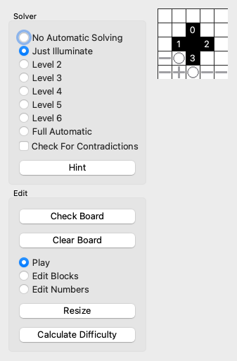

Puzzle Bicycle
==============
Puzzle Bicycle is an application to help people have fun making and solving logic
puzzles like Akari, Heyawake, and Suraromu, by using special solvers that use human
strategies.

For creators, Puzzle Bicycle lets you,
* set and solve your puzzle simultaneously
* know when your puzzle becomes impossible due to an error
* confirm that your puzzle has the difficulty level you intend (TODO)

For players, Puzzle Bicycle lets you,
* automate moves that you find easy
* reset your puzzle to before your first mistake
* ask for hints that teach you how to solve like experts (TODO)

Puzzle Bicycle will not generate random puzzles.

Akari is supported. I plan to do Heyawake and Suraromu next.

Inspiration
-----------
* [Good Sudoku](https://www.playgoodsudoku.com/) uses a catalog of techniques that allow
  puzzles to be graded and contextual hints to be offered.
* [This article](https://web.archive.org/web/20200117074130/https://www.nikoli.co.jp/en/misc/20060703the_japan_time.html) on Nikoli.
* Steve Jobs said that a computer is like
  ["a bicycle for our minds"](https://www.youtube.com/watch?v=ob_GX50Za6c). Puzzle Bicycle is supposed to help you think, not think for you.

How you can help
----------------
I am taking input at this
[issues](https://github.com/AlexSzatmary/puzzle-bicycle/issues) page. I have created
issues for major features that I plan to add; please let me know what you see as a
priority. You can request features there. Of course, please report bugs.

Player guide
------------
This section focuses on how to play puzzles in Puzzle Bicycle. Many of the features are
powerful and primarily present for setters, not players.

 Puzzle Bicycle opens with a simple puzzle and many controls.

Some puzzles are included with this application. More puzzles can be found online at
several sites. Here is one way to get puzzles.
* Go to the [puzz.link database](https://puzz.link/db/?type=akari)
* Pick a puzzle, which will take you to the creator's website.
* Find the link to the puzzle there.
* Click File>Save file as.
* In Puzzle Bicycle, click File>Open to load that puzzle.

Puzzle Bicycle has a solver that operates at adjustable levels. "No Automatic Solving"
disables the solver. With "Just Illuminate," placing a bulb then blocks all free cells
that that bulb sees. Higher levels use increasingly sophisticated methods and all
methods from lower levels. "Just Illuminate" is a good first choice and "Level 2" makes
very simple moves automatically so either of those is a good choice for regular solving.
Higher levels give a lot away but can help when you are stuck.

 In this example of Just Illuminate, the player has placed two bulbs. Cells are then illuminated: the gray lines show where new bulbs cannot be placed.
 Level 2 places bulbs around number cells that need them (the 3), and dots around numbers that have enough bulbs.
 Level 3 places bulbs that are the only way to illuminate a certain dot cell. For this simple puzzle, that level completes the solution.

Check for Contradictions immediately tells you if you have picked a wrong answer and
shows why. This can spoil puzzles.

If you think you made a mistake, Check Board tells you if your board has a contradiction and offers to roll back to your last valid solution, or to erase all mistakes. Clear Board lets you remove all placed clues.

Puzzle Bicycle loads with all controls shown. All controls are also accessible with the menubar. Controls can be shown or hidden with View>Show Controls in Window.

Setter guide
------------
This section is for people who know how to solve puzzles and want to create ("set")
their own puzzles.

To set puzzles, I use this workflow.

1. Make an interesting grid, placing black and white cells.
2. Add number clues. Alternate between adding clues and placing bulbs and dots in
   response, until you need a new clue.
3. Using the solver, check to see that the puzzle has a unique solution that uses many
   different strategies, including even strategies that Puzzle Bicycle does not handle
   directly. Varying the solver level shows which strategies are involved.
4. Test solve myself, with the solver at just level 1 or 2.

I normally use these options: varying levels for step 2, Full Automatic in step 3, and
Check For Contradictions to immediately identify unworkable clues. Clear Board is useful
for solving the board from scratch.

Setting a puzzle is always an iterative process. For example, I sometimes find that I
need to rearrange the grid and even resize the puzzle to bring out interesting
strategies. Puzzle Bicycle removes tedium from these iterations.

Resize makes this menu:  which adds or subtracts one row or column at
a time from a given side of the board. For example, to add a row at the bottom, click
the bottom +.

Akari methods
-------------
Throughout, a bulb is a cell that shines light and a dot is any white cell that is known to not be a bulb. Horizontal and vertical lines act like dots.

Level 1:
* `illuminate`

Level 2:
* `mark_dots_around_full_numbers`
 
* `mark_bulbs_around_dotted_numbers`

Level 3:
* mark_unique_bulbs_for_dot_cells(i, j, mark)
* fill_holes(i, j, mark)

Level 4:
mark_dots_at_corners(i, j, mark)

Level 5:
analyze_diagonally_adjacent_numbers(i, j, mark)

Level 6:
shared_lanes_bot.mark_bulbs_and_dots_at_shared_lanes(i, j, mark)
mark_dots_beyond_corners(i, j, mark)

Level 9:
* `guess_and_check`: for each free cell, try a dot or bulb and then solve; if a
  contradiction occurs, the cell should hold the opposite symbol.

Some of these strategies were articulated well by
[tomamic](https://www.ce.unipr.it/people/tomamic/files/akari-techniques.html).